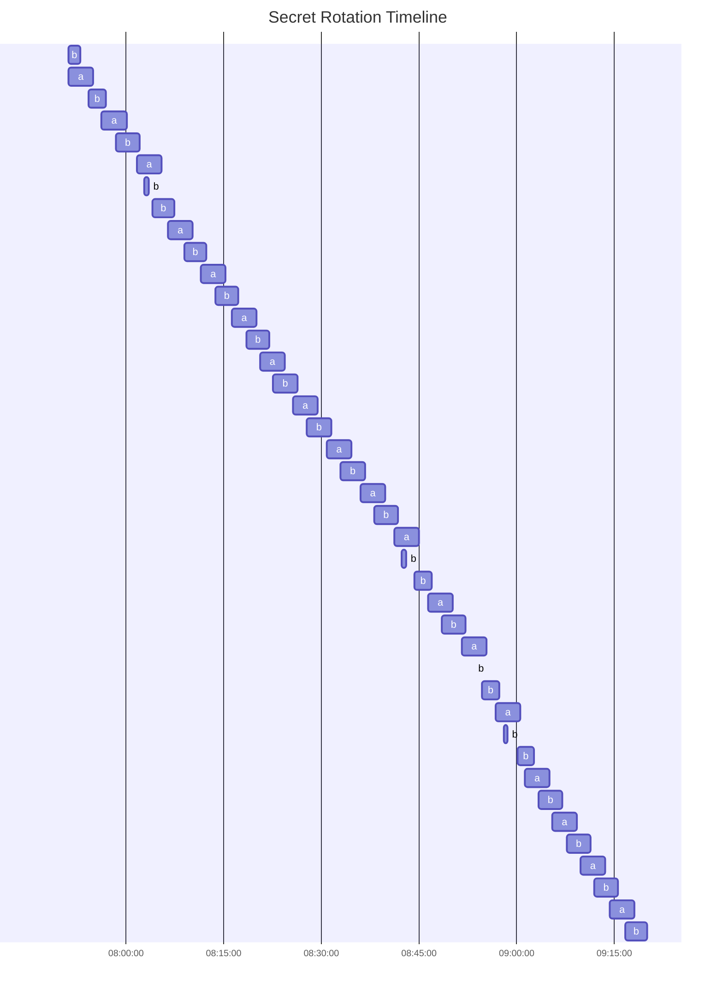
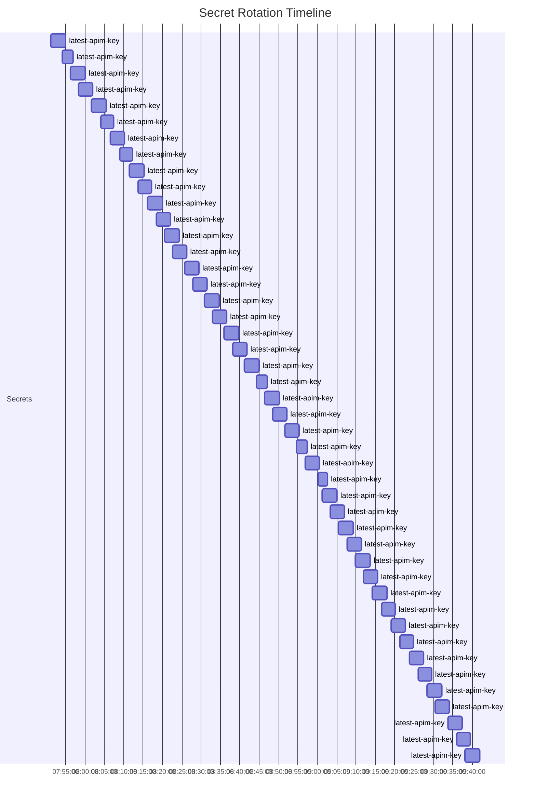

# Introduction

This is a little test to see how feasible it is to use terraform to manage a dual key rotation that stays in sync.
Intent is to provide a maximum cut-over period between key rotations, so apps that don't immediately refresh the value
can still function while using the previous secret value, up to half the rotation time.

It doesn't work very well, and I am not a fan of this approach

## How to run

1. Create or find an existing resource group and key vault in your subscription.
2. Clone repo
3. Add a `.tfvars` and populate variables. e.g.
    ```
    # vars.tfvars
    key_vault_name = "kvalektest"
    resource_group = "testing"
    ```
4. Initialize and apply
   ```
   terraform init
   terraform apply -auto-approve
   ```
5. Run `forever-apply.ps1`
6. Let it run for a while
7. In a new console, use `secret-history.ps1` and `secret-history-diagram.ps1` to view the history of the secrets.


Secrets:
a - Primary key
b - Secondary key
latest-apim-key - The destination secret. The old version of the secret should still be valid for up to half the rotation time

#### secret-history.ps1

View an ordered sequence of versions from all specified secrets.

We expect this to alternate between a and b.

```
 .\secret-history.ps1 -KeyVaultName kvalektest -SecretNames "a", "b"
----------------------------------------------------
 Azure Key Vault Secret Rotation History
----------------------------------------------------

Timestamp             SecretName Expires               Value
---------             ---------- -------               -----
11/02/2025 9:28:18 AM a          11/02/2025 9:32:07 AM B5a2
11/02/2025 9:26:04 AM b          11/02/2025 9:29:30 AM q1yD
11/02/2025 9:23:48 AM a          11/02/2025 9:27:30 AM L0KP
11/02/2025 9:21:22 AM b          11/02/2025 9:24:49 AM yyuf
11/02/2025 9:19:01 AM a          11/02/2025 9:22:49 AM ZakE
11/02/2025 9:16:39 AM b          11/02/2025 9:20:03 AM GSCu
11/02/2025 9:14:19 AM a          11/02/2025 9:18:03 AM 09kY
11/02/2025 9:11:55 AM b          11/02/2025 9:15:35 AM gPos
11/02/2025 9:09:47 AM a          11/02/2025 9:13:35 AM m87t
11/02/2025 9:07:39 AM b          11/02/2025 9:11:19 AM lxF9
11/02/2025 9:05:31 AM a          11/02/2025 9:09:19 AM Fmu9
11/02/2025 9:03:23 AM b          11/02/2025 9:07:01 AM 0oWo
11/02/2025 9:01:14 AM a          11/02/2025 9:05:01 AM FWA9
11/02/2025 9:00:08 AM b          11/02/2025 9:02:37 AM 52o5
11/02/2025 8:58:00 AM b          11/02/2025 8:58:37 AM xH0K
11/02/2025 8:56:48 AM a          11/02/2025 9:00:37 AM JEze
11/02/2025 8:54:39 AM b          11/02/2025 8:57:21 AM 3O5I
11/02/2025 8:53:35 AM b          11/02/2025 8:53:21 AM i0sX
11/02/2025 8:51:33 AM a          11/02/2025 8:55:21 AM wNtl
11/02/2025 8:48:28 AM b          11/02/2025 8:52:12 AM Rreg
11/02/2025 8:46:24 AM a          11/02/2025 8:50:12 AM rwyT
11/02/2025 8:44:20 AM b          11/02/2025 8:47:01 AM vKW2
11/02/2025 8:42:16 AM b          11/02/2025 8:43:01 AM rsXD
11/02/2025 8:41:13 AM a          11/02/2025 8:45:01 AM 7CAh
11/02/2025 8:38:05 AM b          11/02/2025 8:41:47 AM BLT7
11/02/2025 8:35:59 AM a          11/02/2025 8:39:47 AM LXDC
11/02/2025 8:32:55 AM b          11/02/2025 8:36:40 AM PLBe
11/02/2025 8:30:52 AM a          11/02/2025 8:34:40 AM xOl3
11/02/2025 8:27:48 AM b          11/02/2025 8:31:29 AM xxGb
11/02/2025 8:25:41 AM a          11/02/2025 8:29:29 AM iyCG
11/02/2025 8:22:37 AM b          11/02/2025 8:26:20 AM yCjF
11/02/2025 8:20:33 AM a          11/02/2025 8:24:20 AM bCgm
11/02/2025 8:18:26 AM b          11/02/2025 8:22:01 AM Ej7w
11/02/2025 8:16:14 AM a          11/02/2025 8:20:01 AM 4mK7
11/02/2025 8:13:47 AM b          11/02/2025 8:17:12 AM nZeo
11/02/2025 8:11:28 AM a          11/02/2025 8:15:12 AM 1mLg
11/02/2025 8:08:58 AM b          11/02/2025 8:12:16 AM XKx1
11/02/2025 8:06:30 AM a          11/02/2025 8:10:16 AM HQRw
11/02/2025 8:04:05 AM b          11/02/2025 8:07:26 AM g3xV
11/02/2025 8:02:50 AM b          11/02/2025 8:03:26 AM toh3
11/02/2025 8:01:38 AM a          11/02/2025 8:05:26 AM OuxD
11/02/2025 7:58:24 AM b          11/02/2025 8:02:04 AM K30Y
11/02/2025 7:56:16 AM a          11/02/2025 8:00:04 AM L6FI
11/02/2025 7:54:11 AM b          11/02/2025 7:56:55 AM KiXF
11/02/2025 7:51:09 AM a          11/02/2025 7:54:55 AM uw8y
11/02/2025 7:51:09 AM b          11/02/2025 7:52:55 AM vBPT
```

#### secret-history-diagram.ps1

View the history of one or more secrets in a mermaid gantt chart:

Usage:
```
.\secret-history-diagram.ps1 -KeyVaultName kvalektest -SecretNames "a", "b"
Mermaid Gantt chart written to SecretRotationHistory.md
```

Output:


As indicated above the implementation has some quirky behaviour with B. There are cases where B runs twice in a row. More work is needed to iron out this approach.

Even with the above B issues, the output seems stable:



tldr; more work needed if using `time_rotating`.