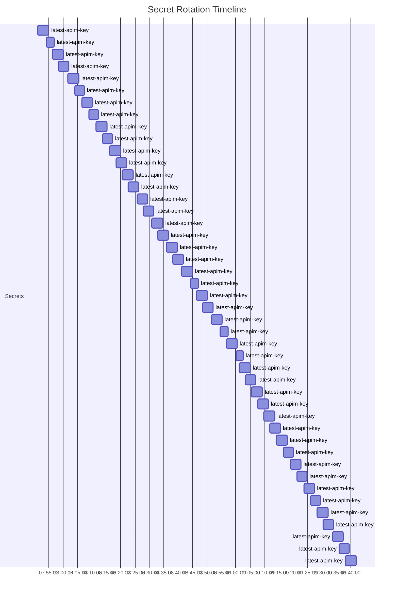

# Azure Key Vault Secret Rotation History

```mermaid
gantt
    title Secret Rotation Timeline
    dateFormat  YYYY-MM-DD HH:mm:ss
    axisFormat  %H:%M:%S  
    tickInterval 5minute
    section Secrets
    latest-apim-key   : 2025-02-11 07:51:09, 2025-02-11 07:54:55
    latest-apim-key   : 2025-02-11 07:54:11, 2025-02-11 07:56:55
    latest-apim-key   : 2025-02-11 07:56:16, 2025-02-11 08:00:04
    latest-apim-key   : 2025-02-11 07:58:24, 2025-02-11 08:02:04
    latest-apim-key   : 2025-02-11 08:01:38, 2025-02-11 08:05:26
    latest-apim-key   : 2025-02-11 08:04:08, 2025-02-11 08:07:26
    latest-apim-key   : 2025-02-11 08:06:29, 2025-02-11 08:10:16
    latest-apim-key   : 2025-02-11 08:08:57, 2025-02-11 08:12:16
    latest-apim-key   : 2025-02-11 08:11:24, 2025-02-11 08:15:12
    latest-apim-key   : 2025-02-11 08:13:45, 2025-02-11 08:17:12
    latest-apim-key   : 2025-02-11 08:16:13, 2025-02-11 08:20:01
    latest-apim-key   : 2025-02-11 08:18:26, 2025-02-11 08:22:01
    latest-apim-key   : 2025-02-11 08:20:33, 2025-02-11 08:24:20
    latest-apim-key   : 2025-02-11 08:22:37, 2025-02-11 08:26:20
    latest-apim-key   : 2025-02-11 08:25:41, 2025-02-11 08:29:29
    latest-apim-key   : 2025-02-11 08:27:48, 2025-02-11 08:31:29
    latest-apim-key   : 2025-02-11 08:30:52, 2025-02-11 08:34:40
    latest-apim-key   : 2025-02-11 08:32:55, 2025-02-11 08:36:40
    latest-apim-key   : 2025-02-11 08:35:59, 2025-02-11 08:39:47
    latest-apim-key   : 2025-02-11 08:38:08, 2025-02-11 08:41:47
    latest-apim-key   : 2025-02-11 08:41:13, 2025-02-11 08:45:01
    latest-apim-key   : 2025-02-11 08:44:20, 2025-02-11 08:47:01
    latest-apim-key   : 2025-02-11 08:46:24, 2025-02-11 08:50:12
    latest-apim-key   : 2025-02-11 08:48:28, 2025-02-11 08:52:12
    latest-apim-key   : 2025-02-11 08:51:33, 2025-02-11 08:55:21
    latest-apim-key   : 2025-02-11 08:54:39, 2025-02-11 08:57:21
    latest-apim-key   : 2025-02-11 08:56:48, 2025-02-11 09:00:37
    latest-apim-key   : 2025-02-11 09:00:08, 2025-02-11 09:02:37
    latest-apim-key   : 2025-02-11 09:01:14, 2025-02-11 09:05:01
    latest-apim-key   : 2025-02-11 09:03:23, 2025-02-11 09:07:01
    latest-apim-key   : 2025-02-11 09:05:31, 2025-02-11 09:09:19
    latest-apim-key   : 2025-02-11 09:07:39, 2025-02-11 09:11:19
    latest-apim-key   : 2025-02-11 09:09:47, 2025-02-11 09:13:35
    latest-apim-key   : 2025-02-11 09:11:57, 2025-02-11 09:15:35
    latest-apim-key   : 2025-02-11 09:14:15, 2025-02-11 09:18:03
    latest-apim-key   : 2025-02-11 09:16:42, 2025-02-11 09:20:03
    latest-apim-key   : 2025-02-11 09:19:02, 2025-02-11 09:22:49
    latest-apim-key   : 2025-02-11 09:21:21, 2025-02-11 09:24:49
    latest-apim-key   : 2025-02-11 09:23:44, 2025-02-11 09:27:30
    latest-apim-key   : 2025-02-11 09:26:08, 2025-02-11 09:29:30
    latest-apim-key   : 2025-02-11 09:28:18, 2025-02-11 09:32:07
    latest-apim-key   : 2025-02-11 09:30:25, 2025-02-11 09:34:07
    latest-apim-key   : 2025-02-11 09:33:42, 2025-02-11 09:37:26
    latest-apim-key   : 2025-02-11 09:36:06, 2025-02-11 09:39:26
    latest-apim-key   : 2025-02-11 09:38:10, 2025-02-11 09:41:58
```
